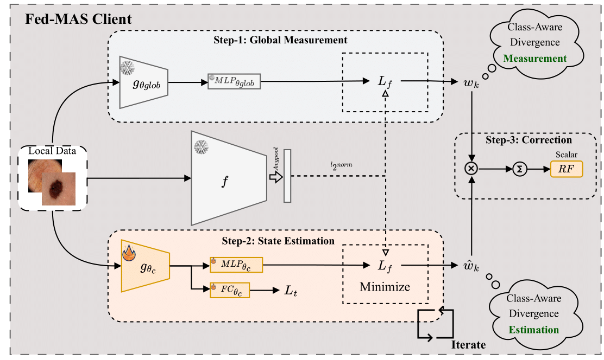

# FedMAS: Federated Model Aggregation via Self-Supervised Priors for Highly Imbalanced Medical Image Classification


This is the official PyTorch implementation of DeCaF-MICCAI 2023 paper 
["Federated Model Aggregation via Self-Supervised Priors for Highly Imbalanced Medical Image Classification"](https://aps.arxiv.org/abs/2307.14959)

## Abstract

In the medical field, federated learning commonly deals with highly imbalanced datasets, including skin lesions and gastrointestinal images. Existing federated methods under highly imbalanced datasets primarily focus on optimizing a global model without incorporating the intra-class variations that can arise in medical imaging due to different populations, findings, and scanners. In this paper, we study the inter-client intra-class variations with publicly available self-supervised auxiliary networks. Specifically, we find that employing a shared auxiliary pre-trained model, like MoCo-V2, locally on every client yields consistent divergence measurements. Based on these findings, we derive a dynamic balanced model aggregation via self-supervised priors (MAS) to guide the global model optimization. Fed-MAS can be utilized with different local learning methods for effective model aggregation toward a highly robust and unbiased global model.



<!-- <p></p> -->
<br clear="left"/>


<br clear="left"/>

### Data Preparation
```
wget https://isic-challenge-data.s3.amazonaws.com/2019/ISIC_2019_Training_Input.zip
unzip ISIC_2019_Training_Input.zip -d data
wget https://dl.fbaipublicfiles.com/moco/moco_checkpoints/moco_v2_800ep/moco_v2_800ep_pretrain.pth.tar
mv moco_v2_800ep_pretrain.pth.tar data/
```

### Environment
First create a Conda environment with python 3.7.13, simply run the following command  
```
conda create -n "fedmas" python=3.7.13
conda activate fedmas
```

Install dependendies
```
conda install pytorch torchvision torchaudio pytorch-cuda=11.7 -c pytorch -c nvidia
pip install -U scikit-learn==1.0.2
pip install tensorboard==2.11.2
pip install pandas==1.3.5
```
Then, you should be able to run federated learning experiments. 
For example, the following command will run FedMAS on Flamby-ISIC over the 5-fold with 6 hospitals/clients on 6 gpus:

BSM-FL
```
python main.py --method fedavg --client_number 6 --pre_trained_tv --thread_number 6 --comm_round 100 --lr 0.0003 --epochs 1 --data_dir data/Flamby_isic --update_projector_head='both' --partition_method='homo' --partition_alpha=0 --model='resnet18'  --gpu='0,1,3,4,5,6,7' --batch_size=64 --loss_fn_name=BSM --adam --validate_client --fold=1
```
Baseline without MAS
```
python main.py --method fedmas --free_u=3 --client_number 6 --pre_trained_tv --pre_trained_models='moco' --thread_number 6 --comm_round 100 --lr 0.0003 --epochs 1 --data_dir data/Flamby_isic --update_projector_head='both' --partition_method='homo' --partition_alpha=0 --model='resnet18' --gpu='0,1,3,4,5,6,7' --batch_size=64 --loss_fn_name=BSM --adam --validate_client --fold=1
```
with MAS
```
python main.py --method fedmas --free_u=3 --client_number 6 --pre_trained_tv --pre_trained_models='moco' --thread_number 6 --comm_round 100 --lr 0.0003 --epochs 1 --data_dir data/Flamby_isic --update_projector_head='both' --partition_method='homo' --partition_alpha=0 --model='resnet18' --gpu='0,1,3,4,5,6,7' --batch_size=64 --loss_fn_name=BSM --adam --validate_client --fold=1 --aggregate_method='MAS'
```


###Acknowledgement
Code design inspired by [FedML](https://github.com/FedML-AI/FedML) and [FedAlign](https://github.com/mmendiet/FedAlign).


Citation
```

```
